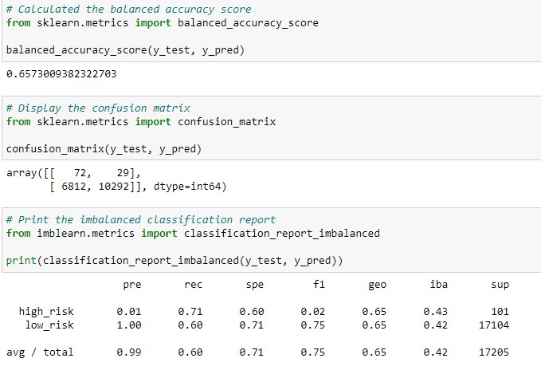
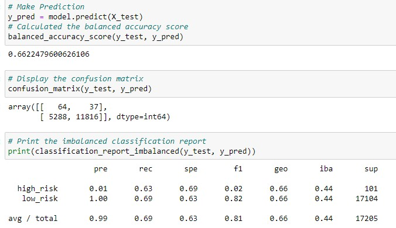
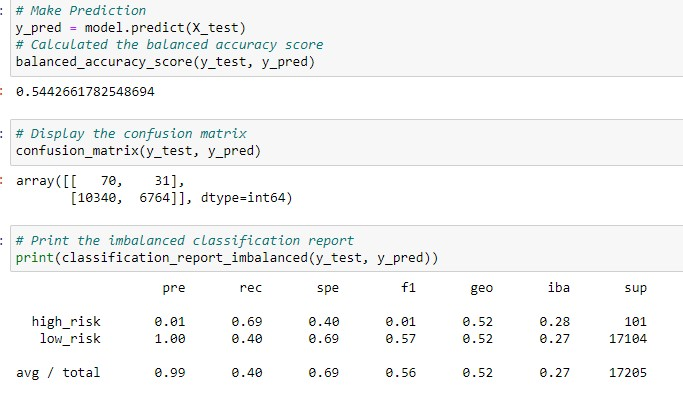
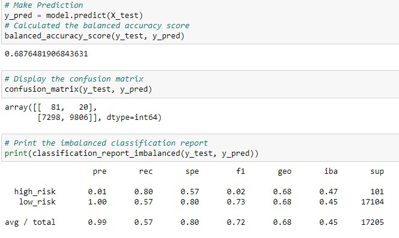
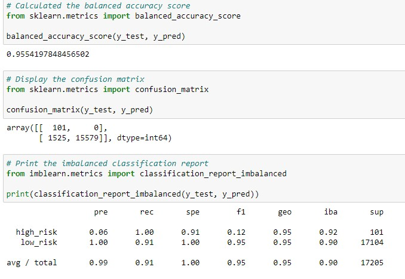
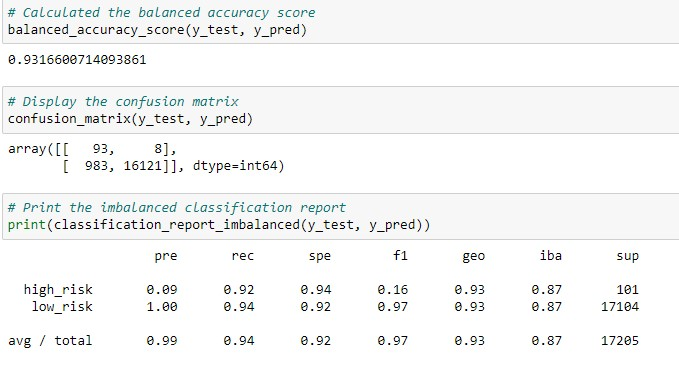

# Credit_Risk_Analysis

## Overview of the analysis:
Credit risk is an inherently unbalanced classification problem, as good loans easily outnumber risky loans.  Therefore, you’ll need to use different techniques to train and evaluate models with unbalanced classes. You will use imbalanced-learn and scikit-learn libraries to build and evaluate models using resampling to predict credit risk.

You will **oversample** the data using the `RandomOverSampler` and `SMOTE` algorithms, and **undersample** the data using the `ClusterCentroids` alogirithm with logistic regression model.  Then, you will use a combinatorial approach of **over-and undersampling** using the `SMOTEENN` algorithm with logistic regression model.  Finally, you will compare two machine learning models `BalancedRandomForestClassifer` and `EasyEnsembleClassifier` hope to reduce bias for predicting credit risk.

## Data Source:
Credit card credit dataset from [LendingClub](https://www.lendingclub.com/), a peer-to-peer lending services company

## Deliverables:
[Deliverable 1](./credit_risk_resampling.ipynb): Use **Resampling Algorithm** to Predict Credit Risk

[Deliverable 2](./credit_risk_resampling.ipynb): Use the **SMOTEENN Algorithm** to Predict Credit Risk

[Deliverable 3](./credit_risk_ensemble.ipynb): Use **Ensemble Classifiers** to Predict Credit Risk

Deliverable 4: A Written Report on the Credit Risk Analysis (this file)

## Results:
We analyse the balanced accuracy score, the precision and recall scores on the **high_risk** class from each model, as our target is to find a model that can predict the high credit risk.

* RandomOverSampler:
    * balance accuracy score: 65.73%
    * precision and recall scores: The precision for **high_risk** is 0.01, and the recall for **high_risk** is 0.71, and the F1 score is 0.02.

* SMOTE:
    * balance accuracy score:
    * precision and recall scores:

* ClusterCentroids:
    * balance accuracy score:
    * precision and recall scores:

* SMOTEENN:
    * balance accuracy score:
    * precision and recall scores:

* Balanced Random Forest Classifier:
    * balance accuracy score:
    * precision and recall scores:

* Easy Ensemble Classifier:
    * balance accuracy score:
    * precision and recall scores:

## Summary:
* Summarize the results of the machine learning models,
* include a recommendation on the model to use, if any. If you do not recommend any of the models, justify your reasoning.

